<div align="center">



<br/>


<br/><br/>



</div>

<br/>

<div align="center">

</div>

## &nbsp; About Me

```js
const meghraj = {
  role: ["Full-Stack Developer", "AI Engineer (Learning)", "Backend Developer"],
  currentlyBuilding: "Hyperion — a Multi-Agent AI Swarm",
  activeProjects: ["Hyperion", "AuroraMusic", "MetroA1Perfume"],
  interests: ["AI Agents", "System Design", "Distributed Systems", "Open Source"],
  tech: {
    languages: ["JavaScript", "Python", "PHP", "Java", "C", "C++"],
    frameworks: ["React", "Node.js", "Flask", "Bootstrap"],
    databases: ["MySQL", "PostgreSQL", "Firebase", "Supabase"],
  },
  goals: "Build startup-scale software and ship production-ready systems.",
};
```

<div align="center">

</div>

## &nbsp; Connect

<div align="center">

[](https://github.com/Meghraj-6093)
[](https://linkedin.com/in/meghraj-ravani)
[](mailto:meghrajravani@gmail.com)


</div>

<div align="center">

</div>

## &nbsp; Featured Projects

<table>
<tr><td width="100%">

### ⟠ Hyperion
**Multi-Agent AI Swarm** — currently in active development.


</td></tr>
<tr><td width="100%">

### ⟠ MetroA1Perfume
**Production-ready PHP E-Commerce platform.**


**[→ View Repository](https://github.com/Meghraj-6093/MetroA1Perfume)**

</td></tr>
</table>

<table>
<tr>
<td width="50%" valign="top">

### ⟠ AuroraMusic
Modern music streaming platform.

`TypeScript`

**[→ View Repository](https://github.com/Meghraj-6093/AuroraMusic)**

</td>
<td width="50%" valign="top">

### ⟠ ClaudeCompanionPro
Desktop productivity toolkit.

`JavaScript`

**[→ View Repository](https://github.com/Meghraj-6093/ClaudeCompanionPro)**

</td>
</tr>
<tr>
<td width="50%" valign="top">

### ⟠ PhantomChat
Real-time chat platform.

`JavaScript`

**[→ View Repository](https://github.com/Meghraj-6093/PhantomChat)**

</td>
<td width="50%" valign="top">

### ⟠ LogForge
Internship logbook management software.

`JavaScript`

**[→ View Repository](https://github.com/Meghraj-6093/LogForge)**

</td>
</tr>
<tr>
<td width="50%" valign="top">

### ⟠ Noted
Modern note-taking application.

`CSS`

**[→ View Repository](https://github.com/Meghraj-6093/Noted-Notepad)**

</td>
<td width="50%" valign="top">

### ⟠ Pokedex
Pokémon API application.

`CSS`

**[→ View Repository](https://github.com/Meghraj-6093/Pokedex)**

</td>
</tr>
<tr>
<td width="50%" valign="top">

### ⟠ PassGen
Password generator.

`CSS`

**[→ View Repository](https://github.com/Meghraj-6093/PassGen)**

</td>
<td width="50%" valign="top">

### ⟠ More
Everything else lives on GitHub.

**[→ View all repositories](https://github.com/Meghraj-6093?tab=repositories)**

</td>
</tr>
</table>

<div align="center">

</div>

## &nbsp; Tech Stack

<div align="center">

</div>

<br/>

<div align="center">

**Languages**
<br/>


<br/><br/>

**Frameworks**
<br/>


<br/><br/>

**Databases**
<br/>


<br/><br/>

**Tools**
<br/>


</div>

<div align="center">

</div>

## &nbsp; GitHub Analytics

<div align="center">


<br/>


<br/>


<br/>


<br/><br/>


<br/><br/>


</div>

<details>
<summary><b>GitHub Metrics (extended report)</b></summary>
<br/>

<div align="center">

</div>

</details>

<div align="center">

</div>

## &nbsp; Currently Learning

<div align="center">


</div>

<div align="center">

</div>

## &nbsp; Roadmap

<table>
<tr>
<td width="50%" valign="top">

**Shipped**

- [x] REST APIs
- [x] Authentication
- [x] CMS
- [x] Firebase
- [x] SQL
- [x] Real-time Apps

</td>
<td width="50%" valign="top">

**In Progress**

- [ ] AI Agent Framework
- [ ] Kubernetes
- [ ] Rust
- [ ] Distributed Systems
- [ ] Startup Launch

</td>
</tr>
</table>

<div align="center">

</div>

<div align="center">


<sub>Meghraj Ravani · built with intent, shipped with discipline</sub>

</div>
